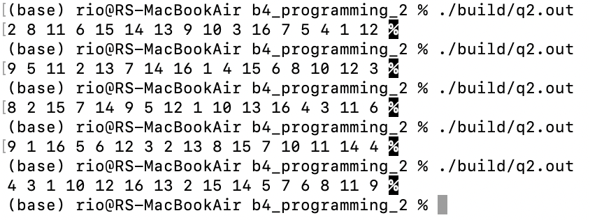

# 問2
q2.cのmainについて
## [1]
最初に大きさ`MAX`の配列を用意し、`1~MAX`を順番に格納している。  
```
for(int i = 0;i < MAX; i++){
		array[i] = i+1;
}
```
## [2]
次に、配列のj番目の要素とランダムな場所の要素を入れ替えている。$0\leq j<$`MAX`についてこの操作を繰り返すことよって順番がバラバラになる。  
```
for(int j = 0; j < MAX; j++){
		int randomNumber = rand() % MAX;
		int tmp = array[randomNumber];
		array[randomNumber] = array[j];
		array[j] = tmp;
}
```


